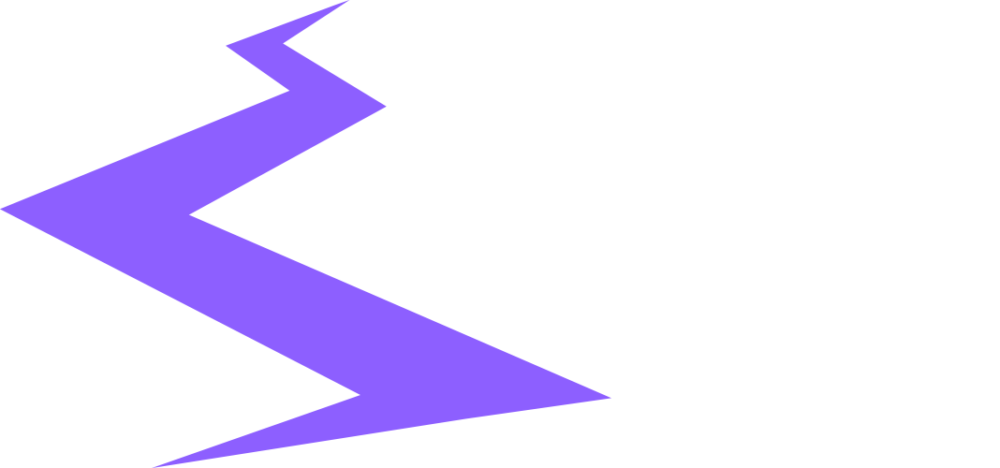

<div align="center">
  
  <h1>🌟 LanPya - AI Learning Platform 🌟</h1>
  
  <p>
    An intelligent, personalized, and fully automated learning platform that creates custom roadmaps, curates video lessons, tests your knowledge with dynamic quizzes, and awards certificates via automated workflows.
  </p>

  <div>
    
    
    
    
    
    
    
    
  </div>
</div>

---

## 📖 Table of Contents
- [Overview](#-overview)
- [Key Features](#-key-features)
- [Screenshots](#-screenshots)
- [Tech Stack](#-tech-stack)
- [System Architecture](#-system-architecture)
- [Getting Started](#-getting-started)
- [Automation & Workflows](#-automation--workflows)
- [Project Structure](#-project-structure)

---

## 🚀 Overview
**LanPya** is not just another LMS (Learning Management System); it is an **AI-powered learning companion**. Designed with a premium dark-themed UI and glassmorphism elements, it provides a seamless and distraction-free learning experience. 

When a user wants to learn a new skill, LanPya can dynamically generate a personalized **Learning Roadmap**, pulling high-quality video resources from the database, organizing them into modules, and generating contextual quizzes to test retention. Once a roadmap is completed, the system automatically triggers an automation pipeline to send a beautifully crafted congratulatory email.

---

## ✨ Key Features

🤖 **LanPya AI Companion**
- A built-in chat interface powered by local LLMs (Ollama) or Gemini to answer student questions, explain difficult concepts, and provide coding assistance in real-time.

🗺️ **Dynamic & Personalized Roadmaps**
- System-curated or AI-generated roadmaps categorized by skill.
- Videos are fetched dynamically from the database and embedded directly for a seamless viewing experience without leaving the platform.

🧠 **Smart Quizzes & Progress Tracking**
- Every lesson requires the user to pass a contextual quiz before advancing. 
- Quizzes are randomized with dynamic questions and shuffled options to prevent memorization and ensure true understanding.

⚡ **Real-Time Global Search**
- Instantly search through all roadmaps and courses via the global header. The platform filters results live as you type.

🏆 **Automated Certification & Rewards**
- Integrated with **n8n workflows**. The moment a user hits 100% completion, a webhook is triggered, sending a visually rich HTML congratulatory email to the user instantly.

---

## 📸 Screenshots

| Home Page | Dashboard |
| :---: | :---: |
|  |  |

| Roadmap Player | LanPya AI Chat |
| :---: | :---: |
|  |  |

*(Note: Ensure your screenshots are uploaded to `Frontend/public/` or `assets` folder in your repo to display correctly!)*

---

## 🛠️ Tech Stack

### **Frontend**
- **Framework:** React.js + Vite
- **Styling:** Tailwind CSS (with custom design system & glassmorphism)
- **State Management & Fetching:** Tanstack Query (React Query), Context API
- **Routing:** React Router v6
- **Icons:** Lucide React

### **Backend**
- **Runtime:** Node.js
- **Framework:** Express.js
- **Database:** MongoDB (with Mongoose ODM)
- **Authentication:** JWT (JSON Web Tokens)
- **Validation:** Joi

### **AI & Automation**
- **LLM Engine:** Ollama (running `gemma4:12b` or similar models) locally, or Gemini API.
- **Workflow Automation:** n8n (Triggering webhooks on course completion).

### **DevOps**
- **Containerization:** Docker & Docker Compose.

---

## ⚙️ System Architecture

1. **User Interaction:** The user interacts with the React frontend to view roadmaps, watch videos, and take quizzes.
2. **API Layer:** The Express backend serves as the REST API, validating requests and communicating with MongoDB.
3. **AI Layer:** When interacting with *LanPya AI* or generating new roadmaps, the backend communicates with the locally running **Ollama** instance to stream LLM responses.
4. **Automation Layer:** When a user completes a roadmap, the backend fires a `POST` request to an external/internal **n8n** webhook. n8n processes the payload (including a customized HTML message) and utilizes SMTP to dispatch an email.

---

## 💻 Getting Started

### Prerequisites
- [Docker](https://www.docker.com/) & [Docker Compose](https://docs.docker.com/compose/)
- [Node.js](https://nodejs.org/) (if running locally without Docker)
- [Ollama](https://ollama.ai/) (Required for local AI processing)

### Installation

1. **Clone the repository:**
   ```bash
   git clone https://github.com/Phyomyatmin646/LanPya.git
   cd LanPya
   ```

2. **Environment Variables:**
   Create a `.env` file in the `Backend` directory:
   ```env
   PORT=5000
   MONGO_URI=your_mongodb_connection_string
   JWT_SECRET=your_jwt_secret
   OLLAMA_URL=http://localhost:11434
   ```
   Create a `.env` file in the `Frontend` directory:
   ```env
   VITE_API_URL=http://localhost:5000/api/v1
   ```

3. **Start the Local LLM:**
   Make sure Ollama is running in the background.
   ```bash
   ollama run gemma4:12b
   ```

4. **Run with Docker Compose:**
   ```bash
   docker compose up --build
   ```
   *This will spin up the Frontend, Backend, and any configured network dependencies simultaneously.*

5. **Access the Application:**
   - Frontend: `http://localhost:3000`
   - Backend API: `http://localhost:5000`

---

## 🤖 Automation & Workflows (N8n)

LanPya integrates with N8n to automate administrative tasks. The primary workflow is the **Course Completion Certificate Email**.

**How it works:**
1. User hits 100% progress on a roadmap.
2. Backend generates a formatted HTML message customized with the user's name and roadmap title.
3. Backend sends a `POST` request to `http://localhost:5678/webhook/roadmap-completed`.
4. N8n catches the webhook, parses `{{ $json.body.html_message }}`, and dispatches the email via an SMTP node.

---

<div align="center">
  <p>Built with ❤️ by Phyo Myat Min</p>
</div>